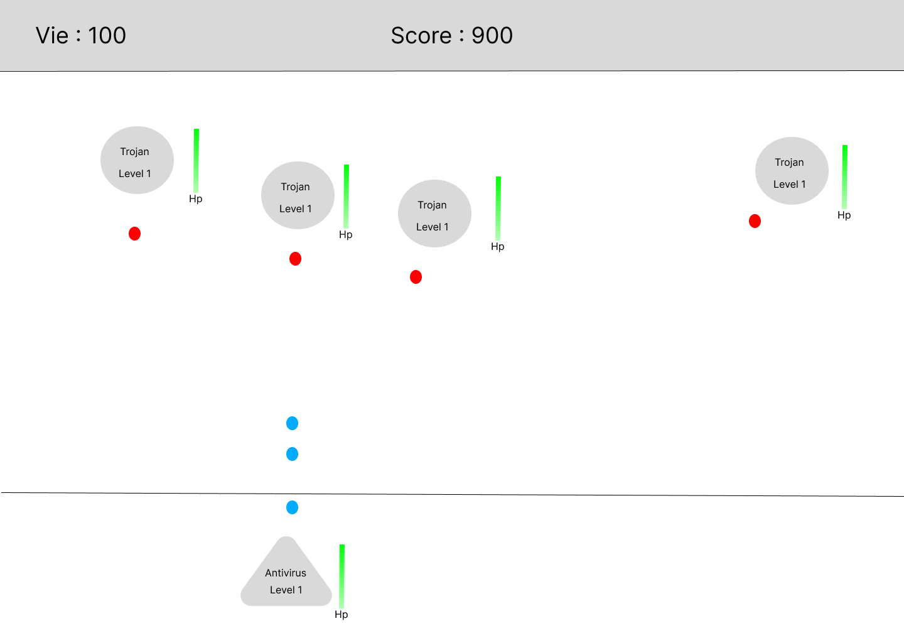

# Projet Shoot'em Up

## Introduction

**Shoot'em Up** est un petit jeu en 2D développée en **C#**. Le but est simple : on contrôle un vaisseau qui doit se défendre contre des ennemis en leur tirant dessus.

Le thème du jeu tourne autour de **l'informatique**. Le vaisseau représente un **antivirus**, et les ennemis sont des **fichiers malveillants** comme des `.exe` ou des **trojans** qui essaient de rentrer dans le système. Le joueur doit donc empêcher ces intrusions en les éliminant.

A chque tir réussi sur un ennemi :
- L’ennemi perd de la vie 
- Le joueur gagne des **coins** 
- Le **score** augmente

Quand un ennemi est détruit, on gagne encore plus de coins. Ces coins permettent d’acheter des **bonus pendant la partie** : comme aller plus vite, faire plus de dégâts, regagner de la vie, ou avoir un multiplicateur de score.

Le **score** permet de voir notre progression. Plus il est élevée, plus les vagues d'ennemis deviennent compliqués. Il y a aussi une section appelé **"Compteurs"** qui affiche quelques statistiques sur la partie.

---

## Planification

| User Story                | Semaine (commencement) | Semaine (finalisation) | Remarques |
| ------------------------- | ---------------------- | ---------------------- | --------- |
| Fonctionalité de tir      |                        |           -            |           |
| Déplacement et controle   |           3            |           5            |           |
| Gains de coins            |                        |           -            |           |
| Affichage de score        |                        |           -            |           |
| Affichage de la vie       |                        |           -            |           |
| Ennemis                   |           5            |           -            |           |

---

## Maquettes

### 1. Objectif
* Le joueur doit controler un **vaisseau Antivirus** qui doit éliminer des ennemis qui sont des virus (cercles).
* L'objectif est de survivre le plus longtemps possible et de faire que son score soit le plus haut possible en tuant les ennemis.

---

### 2. Vaisseau
* **Antivirus (joueur)** :

  * Représenté par un triangle.
  * Possède une **barre de vie** (100 points), qui augmentera au fil de la partie.
  * Tire des projectiles qui font des dégâts de plus en plus elevée au fil de la partie.
  * Améliorable via des bonus (vitesse, dégâts, vie).

---

### 3. Ennemis

* **Virus (ennemis)** :

  * Représentés par des cercles.
  * Niveaux indiquées.
  * Barre de vie.
  * Tirent des projectiles vers le vaisseau (joueur).

---

### 4. Ressources et progression

* **Coins** : monnaie pour acheter des bonus (affichée en haut à gauche).
* **Score** : augmente selon les éliminations (affiché en haut à droite).
* **Bonus** (menu à droite) :

  * Vitesse du vaisseau
  * Dégâts
  * Vie du vaisseau

---

### 5. Compteurs et statistiques

* **Éliminations** : nombre d’ennemis détruits.
* **Munitions tirées** : total de projectiles lancés.

---

### 6. Interactions principales

1. **Déplacements** : le joueur contrôle son Antivirus.
2. **Tirs** : le joueur tire pour éliminer les ennemis.
3. **Gestion de coins** : dépenser les coins pour améliorer son vaisseau.
4. **Survie** : éviter les projectiles ennemis.

