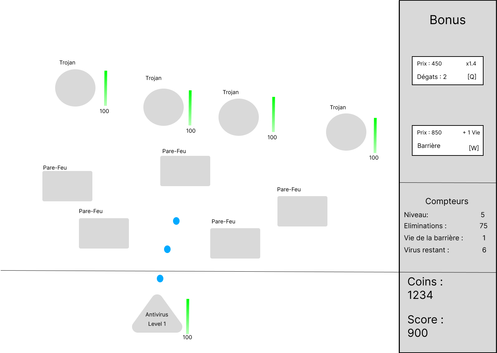
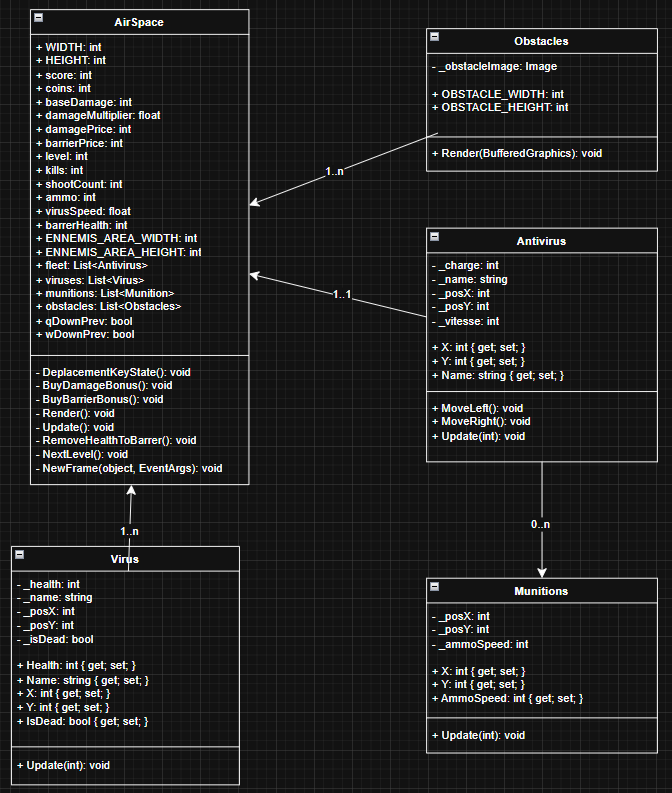

# Projet Shoot'em Up

## 1. Introduction

**Shoot'em Up** est un jeu 2D développé en **C#**. Le joueur contrôle un **vaisseau antivirus** qui doit éliminer des ennemis (fichiers malveillants comme des `.exe` ou des trojans) pour protéger le système.  

À chaque tir réussi sur un ennemi :  
- L’ennemi perd de la vie.  
- Le joueur gagne des **coins**.  
- Le **score** augmente.  

Les coins permettent d’acheter des **bonus** pendant la partie : vitesse, dégâts, régénération de vie, multiplicateur de score.  
Le score reflète la progression : plus il est élevé, plus les vagues d’ennemis deviennent difficiles.

---

## 2. Planification

| User Story                | Semaine (début) | Semaine (fin) | Remarques |
| ------------------------- | --------------- | ------------- | --------- |
| Fonctionnalité de tir     | 5               | 9             |           |
| Déplacement et contrôle   | 3               | 5             |           |
| Gains de coins            | 9               | 9             |           |
| Affichage de score        | 9               | 9             |           |
| Affichage de la vie       | 6               | 9             |           |
| Ennemis                   | 5               | 9             |           |

## 3. Maquette

---

## 4. User Stories

- **Déplacement et contrôle** : le joueur peut déplacer le vaisseau à gauche et à droite pour éviter les tirs et se positionner pour tirer.  

- **Affichage de la vie** : chaque entité a une barre de vie verticale et un nombre précis affiché.  

- **Fonctionnalité de tir** : appuyer sur ESPACE pour tirer des projectiles qui font des dégâts, amélioration possible via coins.  

- **Affichage de score** : tuer des ennemis augmente le score et la difficulté de la partie.  

- **Ennemis** : descendent verticalement et infligent des dégâts si atteignent le bas ou tirent sur le joueur.  

- **Gains de coins** : gagner des coins pour acheter des boosts (vie, dégâts, vitesse, etc.).

## 5. Objectif
* Survie du **vaisseau antivirus**.  
* Éliminer les ennemis pour maximiser le score.  

## 6. Entitées

### Vaisseau
* Tire des projectiles dont les dégâts peuvent évoluer.  
* Améliorable via des bonus (vitesse, dégâts, vie).  
* Protection limitée : maximum 5 impacts ennemis avant la fin de la partie.  

### Ennemis
* **Virus** : descendent verticalement pour atteindre le bas de l’écran.  
  * Barre de vie affichée.  
  * Inflige des dégâts si atteint le bas.  

### Obstacles
* **Pare-Feu** : murs de protection.  
  * Trois rectangles verts représentant la vie.  
  * Casse après 3 impacts.  

### Ressources et progression
* **Coins** : monnaie pour acheter des bonus.  
* **Score** : augmente en éliminant les ennemis.  
* **Bonus** : améliorations des dégâts, vie, vitesse.  

## 6. Compteurs et statistiques
* **Éliminations** : nombre d’ennemis détruits.  
* **Munitions tirées** : total des projectiles lancés.  

## 7. Interactions principales
1. Déplacements du vaisseau.  
2. Tirs sur les ennemis.  
3. Gestion des coins pour acheter des améliorations.  
4. Survie et stratégie pour éviter les tirs ennemis.  

## 8. Diagramme de classes UML

## 9. Description des classes

- **AirSpace** :  
  Classe principale qui gère l’affichage, le lancement de la partie et les interactions globales du jeu.  

- **Obstacles** :  
  Représente les murs et barrières.  
  * Gère la vie des obstacles et leur destruction après plusieurs impacts.  

- **Antivirus** :  
  Représente le vaisseau joueur.  
  * Gestion des déplacements, des tirs et de la vie.  
  * Applique les bonus achetés.  

- **Virus** :  
  Représente les ennemis qui descendent verticalement.  
  * Possède une barre de vie et inflige des dégâts au joueur.  

- **Munitions** :  
  Gère les projectiles tirés par le joueur.  
  * Inflige des dégâts aux ennemis.  
  * Possibilité d’évolution des dégâts selon les bonus.  

