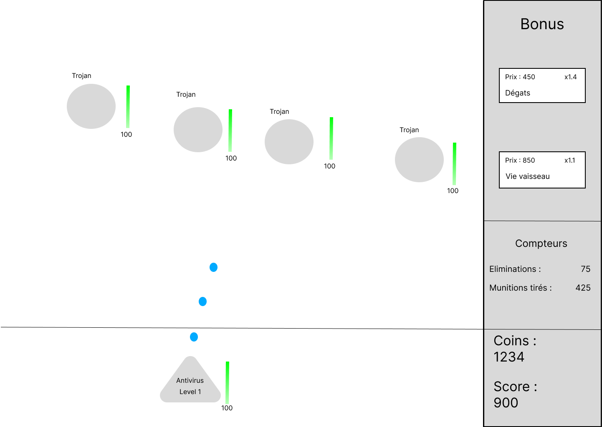

# Projet Shoot'em Up

## Ilustration

## Introduction

**Shoot'em Up** est un jeu 2D développé en **C#**.  
Le joueur contrôle un **vaisseau antivirus** qui doit éliminer des ennemis pour protéger le système.

À chaque élimination :  
- L’ennemi perd de la vie.  
- Le joueur gagne des **coins**.  
- Le **score** augmente.  

Les coins permettent d’acheter des **bonus** pendant la partie : vitesse, dégâts, régénération de vie, multiplicateur de score.  
Le score reflète la progression du joueur : plus il est élevée, plus les vagues d’ennemis deviennent difficiles.

---

## 1. Objectifs pédagogique

Le but de ce projet était d’apprendre à :  
- Concevoir un jeu 2D complet en C#.  
- Travailler avec des classes, des objets et des événements.  
- Appliquer une logique de jeu (physique, collisions, interactions).  
- Organiser un projet avec une planification (User Stories).  
- Utiliser Git pour suivre l’évolution du projet.  

---

## 2. Planification

| User Story                | Semaine (début) | Semaine (fin) |
| ------------------------- | --------------- | ------------- |
| Déplacement et contrôle   | 3               | 5             |
| Fonctionnalité de tir     | 5               | 9             |
| Ennemis                   | 5               | 9             |
| Affichage de la vie       | 6               | 9             |
| Gains de coins            | 9               | 9             |
| Affichage de score        | 9               | 9             |

---

## 3. Maquette du jeu

La maquette montre la zone de jeu avec le vaisseau en bas, les ennemis en haut, et les barres de vie affichées pour chaque entité.  
Les scores et coins sont visibles en bas a droite de l’écran.

---

## 4. User Stories

| Fonctionnalité              | Description | Test d’acceptation |
|----------------             |--------------|--------------------|
| **Déplacement et contrôle** | Le joueur peut se déplacer à gauche/droite pour éviter les ennemis. | Le vaisseau se déplace sans dépasser les bords de la fenêtre. |
| **Fonctionnalité de tir**   | Appuyer sur **Espace** tire un projectile qui fait des dégâts. | Les tirs détruisent un ennemi après plusieurs impacts. |
| **Affichage de la vie**     | Chaque entité affiche une barre de vie. | La barre diminue lors d’un tir reçu. |
| **Affichage du score**      | Le score augmente à chaque élimination. | +1 au score après la mort d’un ennemi. |
| **Gains de coins**          | Les ennemis lâchent des coins. | Le compteur de coins augmente. |
| **Ennemis**                 | Les virus descendent vers le bas et infligent des dégâts. | Le joueur perd de la vie si un ennemi atteint le bas. |

---

## 5. Objectif du jeu

- Survire le plus longtemps possible avec le **vaisseau antivirus**.  
- Éliminer les ennemis pour **augmenter le score** et **acheter des bonus**.

---

## 6. Entités du jeu

### Vaisseau (Antivirus)
- Tire des projectils.  
- Peut améliorer dégats, vitesse et vie.  
- Meurt après que la barrière ce casse.  

### Ennemis (Virus)
- Descendent verticalement.  
- Ont une barre de vie visible.  
- Infligent des dégâts s’ils atteignent le bas de l’écran.  

### Obstacles (Pare-Feu)
- Trois rectangles vert représentant la vie.  
- Protègent temporairement le joueur.  
- Se détruisent après 3 impacts.  

### Ressources
- **Coins** : utilisé pour acheter des bonus.  
- **Score** : reflète la progression du joueur.  
- **Bonus** : permetent d’améliorer les stats du vaisseau.

---

## 7. Compteurs et statistiques
- **Éliminations** : nombre d’ennemis détruits.  
- **Munitions tirées** : total des projectiles lancés.  
- **Score total** : reflète la performance du joueur.

---

## 8. Interactions principales
1. Déplacement du vaisseau.  
2. Tirs sur les ennemis.  
3. Collecte de coins et achat de bonus.  
4. Éviter ou bloquer les projectiles ennemis.

---
## 9. Diagramme de classes UML

## 10. Description des classes

## AirSpace  
C’est la **classe principale** du jeu.  
Elle s’occupe de **tout gérer**, comme la boucle du jeu, les touches, l’affichage et la logique générale.

**Choses qu'il fait :**  
- Gère la fenêtre et le rendu du jeu.  
- Gère les vagues d’ennemis et les obstacles.  
- Suivi du score, des coins, des kills et du niveau.  
- Achats de bonus (dégats, barrière).  
- Passage au niveau suivant quand tout est fini.  

**Méthodes principales :**  
- `DeplacementKeyState()` --> gère les touches du joueur.  
- `BuyDamageBonus()` / `BuyBarrierBonus()` --> achète les bonus.  
- `NextLevel()` --> passe au niveau suivant.  
- `Render()` et `Update()` --> affichent et mettent à jour le jeu.  

---

## Obstacles  
C’est les **barrières de défense** entre le joueur et les ennemies.  

**Choses qu'il fait :**  
- Affiche les obstacles à l’écran.  
- Gère leur vie et quand ils sont détruits après plusieurs impacts.  

**Méthodes principale :**  
- `Render(BufferedGraphics)` --> affiche l’obstacle à l’écran.  

---

## Antivirus  
C’est le **vaisseau du joueur**.  

**Choses qu'il fait :**  
- Gère les mouvement (gauche / droite).  
- Tire des projectils (création de `Munitions`).  
- Applique les bonus (dégats, vitesse, vie).  

**Méthodes principales :**  
- `MoveLeft()` / `MoveRight()` --> déplace le joueur.  
- `Update(int)` --> met à jour la position et l’état du joueur.  

---

## Virus  
C’est les **ennemis** que le joueur doit détruire.  

**Choses qu'il fait :**  
- Descendent verticalement sur l’écran.  
- Gèrent leur vie et leur mort.  
- Font des dégats si ils atteignent le bas.  

**Méthodes principales :**  
- `Update(int)` --> met à jour la position du virus.  

---

## Munitions  
C’est les **balles** tirées par le joueur.  

**Choses qu'il fait :**  
- Se déplacent vers le haut.  
- Touchent les ennemis et font des dégats.  
- Les dégats changent selon le bonus.  

**Méthodes principales :**  
- `Update(int)` --> met à jour la position de la munition.  

## 11. Utilisation de l’IA

Pendant le développement, j’ai utilisé l’IA pour :  
- Corriger la grammaire et reformuler certaines phrases du rapport.  
- M’aider à structurer la planification (tableau des User Stories).  
- Vérifier la clarté de la description du diagramme UML.  
- Trouver des idées de bonus et de mécaniques de jeu.  

---

## 12. Conclusion

Le jeu est **fonctionnel et complet**.  
Toutes les fonctionnalités de base (tir, ennemis, score, coins, bonus) sont présents et opérationnels.  
J’ai beaucoup appris sur la gestion des collisions, les classes et la logique d’un jeu en C#.  
Même si le rapport demandait quelques ajouts, j’ai fais un effort sur la partie technique et le rendue final.

---

### Projet réalisé par Okkes Erdem Köse